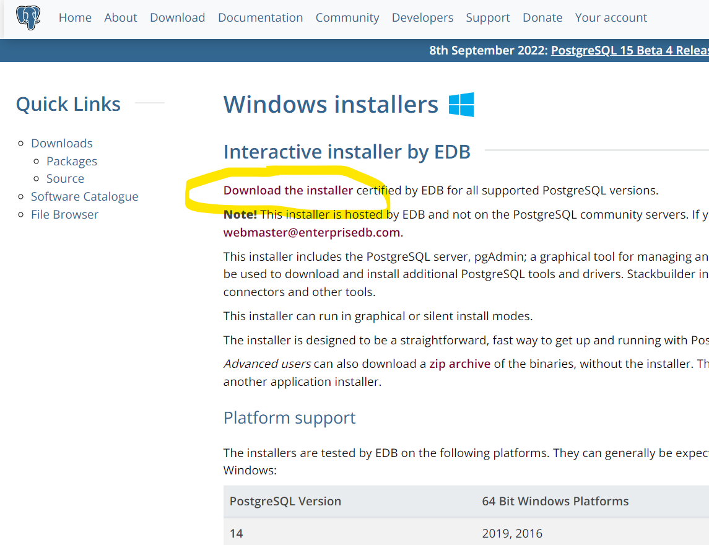
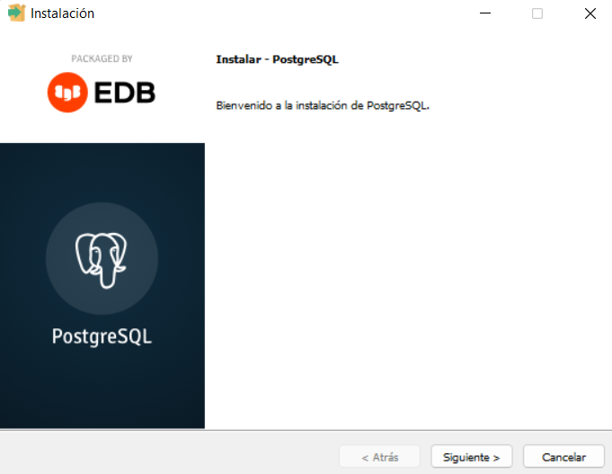
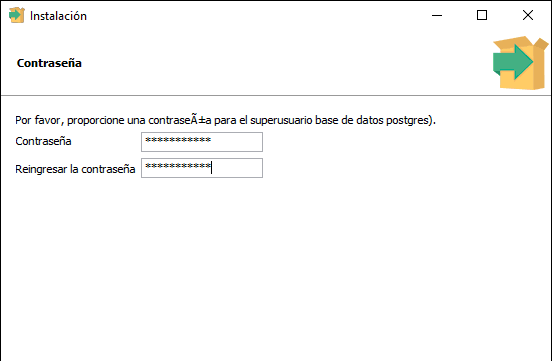
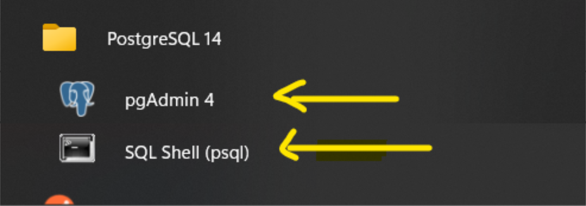
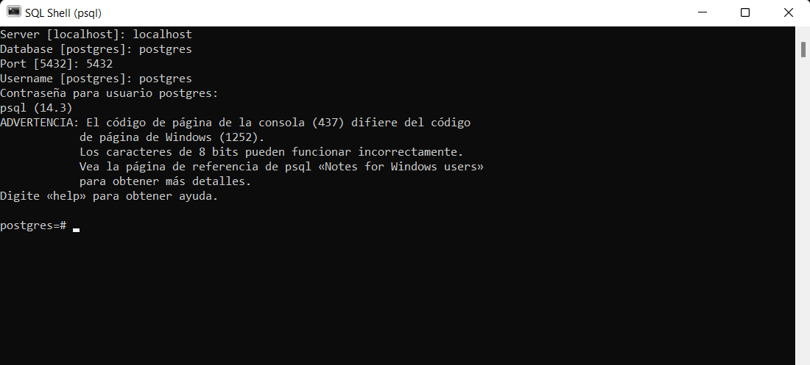
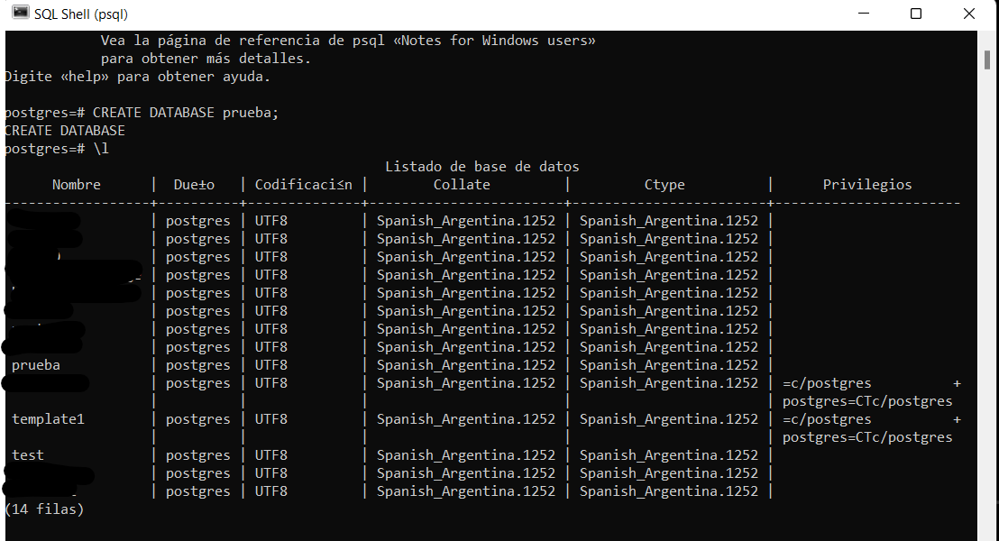

<br>
<br>

<p align="justify"> Free Forest es un proyecto grupal que se desarrolló como prueba técnica de la empresa Creditú. El principal requisito a cumplir fue la puesta en escena de un dashboard de consulta de puntos en una aplicación web de un juego hipotético, el cual también tuvimos que desarrollar conceptualmente y está basado en la concientización del medio ambiente, enfocándonos con profundidad en la forestación, la cual te invitamos a visitarla en el siguiente enlace. </p>  

🌲🌲 [Free Forest](https://delosandes.xyz) 🌲🌲

<br>
<br>
<h1> Primeros pasos 🚀 </h1>

Con las siguientes instrucciones podrás poner en funcionamiento nuestro proyecto localmente .

**📑    Requerimientos**

Para poder poner a correr esta aplicación tendrás que tener instalado en tu ordenador con anterioridad la última versión de NPM y Node, puedes chequear en consola si la tienes instalada haciendo “npm -v” y “node-v”

Sino en el siguiente link puedes descargarla gratuitamente - 

🌐  [NodeJs](https://nodejs.org/es/download/)

Copia el repositorio haciendo click en Fork, así obtendrás una copia del mismo en tu Github.


A continuación haz click en Code, copiando el link del repositorio para clonarlo localmente mediante gitBash o puedes descargar el Zip para luego descomprimirlo en tu computadora.


<br>
<br>
<h1>Para instalar 🛠 </h1>

Llegó el momento para ejecutar en tu ordenador nuestro proyecto.

Abre la consola de tu editor y ejecuta los siguientes comandos.
```sh
   npm install
```

Con este comando descargamos e instalamos todas las dependencias que utilizamos en el proyecto de forma automática. El tiempo de este proceso depende de tu conexión a internet y del poder del procesamiento de tu ordenador, ten paciencia, puede tardar unos minutos.

<br>

<h1>Despliegue Local ⚙️ </h1>

Antes de correr el comando de inicio es necesario crear un archivo .env en la raiz del directorio del proyecto. 

<h2>Parametrización de las variables de entorno 📄 </h2>

En su despliegue local utiliza las siguientes variables de entorno
```
DB_NAME= nombre que tendra la base de datos que hayas creado
```
```
DB_USERNAME= nombre de usuario de la base de datos, generalmente es 'postgres' pero eso dependera de como configures tu bd
```
```
DB_HOST= endpoint que te asigne la base de datos, generalmente cuando es local es 'localhost'
```
```
DB_PASSWORD= contraseña que hayas definido para acceder a tu bd
```
```
DB_PORT= puerto de conexion de la base de datos, por ejemplo en PostgreSQL es 5432
```
```
PORT= puerto local, generalmente es 8080
```
Una vez definidas las variables de entorno, al correr el comando npm run dev, el server detectara que estas en un ambiente de desarrollo y tomara de manera automatica las variables previamente definidas

<h3>Creación de base de datos PostgreSQL</h3>
En caso de aun no contar con una base de datos, sigue los siguientes pasos para crear una:

- Descargar la ultima versión estable de Postgres de su web oficial [Postgres](https://www.postgresql.org/download/)




- Ejecutamos el instalador, este incluye las herramientas de lineas de comando, la interfaz visual pgAdmin y el servidor de Postgres



- Asignar la contraseña para el superusuario de la base de datos de PostgreSQL



- En la próxima ventana dejaremos el puerto por defecto para PostgreSQL: 5432

- Una vez completa la instalación podemos seleccionar ingresar a través de la interfaz grafica o de la consola SQL Shell



- En SQL Shell completamos los requerimientos, por defecto podemos dar 'enter' en todos los campos MENOS en la contraseña, donde colocaremos la indicada previamente en el instalador 



- En este momento ya estamos conectados al servidor de Postgres. Podemos crear una base de datos con el comando:
```
   CREATE DATABASE prueba;
``` 
- Veremos un mensaje de confirmación de que la base ha sido creada con éxito. A continuación podemos desplegar un listado de las bases de datos ejecutando el comando: 
```
   \l 
```


- El paso final seria reemplazar las credenciales en el archivo .env 
```
    DB_NAME= prueba
    DB_USERNAME= postgres
    DB_HOST= localhost
    DB_PASSWORD= contraseña que hayas definido 
    DB_PORT= 5432
```
<br>


<h2>Ejecución  del proyecto 💻</h2>

Para realizar el despliegue local solo necesitas abrir una terminal en la raiz de la carpeta donde guardaste el repositorio en tu computador y ejecutar el comando.

```sh
  npm run dev
```

Este comando levantara el servidor y la conexion a la base de datos. Ya estás listo para hacer peticiones!

En el siguiente link vas a tener acceso a la documentación de nuestra API

📄 [Documentación](https://documenter.getpostman.com/view/20723185/VVkMWArr)

<br>

<h1> Ejecución de tests 🛠</h1> 
Los tests fueron desarrollados con el framework Jest y el modulo de node Supertest que permite hacer llamados a las rutas. 

Para empezar a correr los tests solo hay que ejecutar el comando 
```sh
  npm test
```
Tener en cuenta que la base de datos se vera afectada por esta ejecución, por lo que recomendamos que las variables de entorno definidas localmente sean para una db de desarrollo y testeo específicamente.

También está disponible el comando
```sh
  npm run test:cov
```
Esto ejecuta la metrica Code Coverage, que permite conocer la calidad y cuanto de tu codigo está siendo testeado, ayudandote a mejorar y lograr la mayor cobertura posible!
<br>
<br>

<h1>Stack de desarrollo 🛠</h1>

Las tecnologías utilizadas para el desarrollo fueron:

- **Express**
- **Sequelize**
- **PostgreSQL**
- **NodeJs 16.14.2**
- **Npm 8.5**
- **Jest**
- **Supertest**


<br>
<br>
<h1> Imagen Docker 🐙 </h1>
Las imagenes Docker de este proyecto estan pensadas para correr en simultaneo tanto back como front.
Para poder manipular nuestras imagenes Docker como principal requisito es tener instalado en tu ordenador Docker, el cual en el siguiente enlace puedes obtener el paso a paso para la instalación. 

https://www.docker.com/products/docker-desktop/ 

Luego ingresa en la terminal de tu ordenador e ingresa el siguiente comando para poder descargar las imagenes.

Front
```
docker pull gianfrancogobbi/freeforest_front:v1
```

Back
```
docker pull gianfrancogobbi/freeforest_back:v1
```

Cuando termine el proceso de descarga ya puedes correr tus imagenes con los siguientes comandos

Front
```
docker run -it -p 3000:3000 gianfrancogobbi/freeforest_front:v1
```

Back
```
docker run -it -p 8080:8080 gianfrancogobbi/freeforest_back:v1
```

Ya con todos estos pasos, solamente queda ingresar a Free Forest a navegar en el siguiente enlace.

http://localhost:3000/

<br>
<br>
<h1> Despliegue productivo ⚙️</h1>

El proyecto cuenta con un flujo de despliegue a través de Github Actions donde se realizan unos checkeos tanto en el pull request como en el push, ejecutando **Eslint** siendo este un paso dependiente para que los **tests funcionales** se lancen. 

Esta aplicacion web fue desplegada utilizando los siguientes servicios de AWS:
  - **Elastic Beanstalk** : Este servicio de Amazon integra la maquina virtual y la conexión a la base de datos. Maneja el balanceo de carga, auto scaling y monitoreo.
  - **RDS** : Base de datos relacional PostgreSQL.
  - **CodeBuild** : Servicio de integración continua completamente administrado que compila el código. 
  - **CodePipeline** : Es un servicio que permite una canalización de trabajo continuo para desplegar una aplicación.
  - **Route53** : Servicio confiable para enrutar a los usuarios a las aplicaciones de Internet. Se utilzó para hostear una URL con un certificado SSL.
  - **AWS Amplify** : Se utilizó para hostear la aplicación del frontend, permitiendo configurar una canalización de trabajo continuo incluyendo su propia compilación y deploy. 

<br>
<h1>Equipo de desarrollo 🌄</h1>

<div style="display:flex; align-items:center; width: 100%">
<div >

- [Florencia Taburelli](<https://github.com/orgs/delosandesdevs/people/FlorenciaTaburelli>)

</div>


<div >

- [Juano Cataldo](<https://github.com/orgs/delosandesdevs/people/juanocataldo>)

</div>


<div >

- [Ramiro Grisales](<https://github.com/orgs/delosandesdevs/people/orimarselasirg>)

</div>


<div >

- [Rodrigo Pérez](<https://github.com/orgs/delosandesdevs/people/rodrigo0109>)

</div>


<div >

- [Gianfranco Gobbi](<https://github.com/GianfrancoGobbi>)

</div>


</div>

<br><br>


<div align="center">


**De Los Andes development**
</div>

